# Комплексные числа

## Мотивация
Почему стоило рассказать о комплексных числах в школьном спринте?

- интегрируют в себе идеи из функций, тригонометрии, экспоненты, векторов, а это значит возможность посмотреть взаимосвязь этих понятий.
- применяются при решении уравнений, в теории чисел, комбинаторике, вычислении логарифмов из отрицательных чисел, тригонометрических уравнений вида $\cos(x) = c, \; c > 1$
- личный вызов, по мере подготовки презентации вскрываются пробелы в понимании комплексных чисел и тех школьных понятий, которые с ними связаны.

---

## Предыстория

Откуда взялись комплексные числа.

$\mathbb{N}$ - **натуральные числа**:

**Операции:**
[&checkmark;]: $a + b = c$, где $a, b, c \in \mathbb{N}$
[&times;]: $a - b = c$, где $a, b, c \in \mathbb{N}$, но только при $a > b$
[&checkmark;]: $a \cdot b = c$, где $a, b, c \in \mathbb{N}$
[&times;]: $a/b = c$, где $a, b \in \mathbb{N} \iff a \mathbin{\vdots} b$
[&times;]: $\sqrt{a} = c$, где $a, c \in \mathbb{N} \iff a = b^2, \; b \in \mathbb{N}$

---

$\mathbb{Z}$ - **целые числа**:

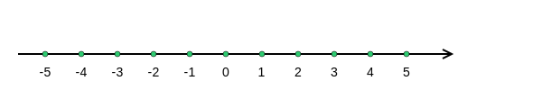

**Операции:**
[&checkmark;]: $a + b = c$, где $a, b, c \in \mathbb{Z}$
[&checkmark;]: $a - b = c$, где $a, b, c \in \mathbb{Z}$
[&checkmark;]: $a \cdot b = c$, где $a, b, c \in \mathbb{Z}$
[&times;]: $a / b = c$, где $a, b, c \in \mathbb{Z} \iff a \mathbin{\vdots} b$
[&times;]: $\sqrt{a} = c$, где $a, c \in \mathbb{Z} \iff a = b^2, b \in \mathbb{Z}$

**Итог:** $\mathbb{N} \subset \mathbb{Z}$

---

$\mathbb{Q}$ - **рациональные числа**

**Операции:**
[&checkmark;]: $a + b = c$, где $a, b, c \in \mathbb{Q}$
[&checkmark;]: $a - b = c$, где $a, b, c \in \mathbb{Q}$
[&checkmark;]: $a \cdot b = c$, где $a, b, c \in \mathbb{Q}$
[&checkmark;]: $a / b = c$, где $a, b, c \in \mathbb{Q}$
[&times;]: $\sqrt{a} = c$, где $a, c \in \mathbb{Q} \iff a = b^2, b \in \mathbb{Q}$

**Итог:** $\mathbb{N} \subset \mathbb{Z} \subset \mathbb{Q}$

---

$\mathbb{I}$ - **иррациональные числа**:

- $\pi, e, \sqrt{2}, -\sqrt{3}$

Появляются при попытке, например, найти длину гипотенузы треугольника с катетами длиной $1$:

<left>
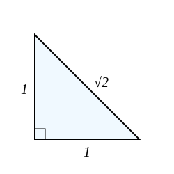
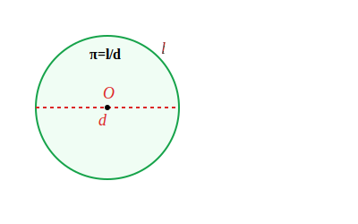
</left>

**Операции:**
[&times;]: $a + b = c$, где $a, b \in \mathbb{I}$, $c \in \mathbb{I}$ или $c \in \mathbb{Q}$
[&times;]: $a - b = c$, где $a, b \in \mathbb{I}$, $c \in \mathbb{I}$ или $c \in \mathbb{Q}$
[&times;]: $a \cdot b = c$, где $a, b \in \mathbb{I}$, $c \in \mathbb{I}$ или $c \in \mathbb{Q}$
[&times;]: $a / b = c$, где $a, b \in \mathbb{I}$, $c \in \mathbb{I}$ или $c \in \mathbb{Q}$
[&check;]: $\sqrt{a} = c$, где $a, c \in \mathbb{I}$

---

$\mathbb{R}$ - **действительные числа**:

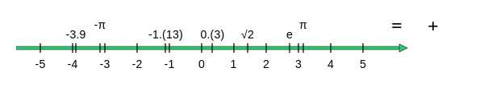

[&checkmark;]: $a + b = c$, где $a, b, c \in \mathbb{R}$
[&checkmark;]: $a - b = c$, где $a, b, c \in \mathbb{R}$
[&checkmark;]: $a \cdot b = c$, где $a, b, c \in \mathbb{R}$
[&checkmark;]: $a / b = c$, где $a, b, c \in \mathbb{R}$
[&times;]: $\sqrt{a} = c$, где $a, c \in \mathbb{R} \iff a \ge 0$

**Итог:** $\mathbb{N} \subset \mathbb{Z} \subset \mathbb{Q} \subset \mathbb{R}$
$\mathbb{R} = \mathbb{Q} + \mathbb{I}$
$\mathbb{R}$ содержит все точки на прямой, **нет дыр** (пробелов)

---

$\mathbb{C}$ - **компле&#769;ксные числа**

Комплексные числа возникли при необходимости обойти ограничение, связанное с **вычислением отрицательных корней**.

Рафаэль Бомбелли в своей работе «Алгебра» (1572г.) разобрал уравнение, которое поставило в тупик его современников. Это уравнение:

$$
x^3=15x+4
$$

Если использовать формулу Кордано, то получим:
$$
x = \sqrt[3]{2+\sqrt{-121}} + \sqrt[3]{2-\sqrt{-121}}
$$
т.е. **решений нет**

Но если взять $x=4$, то $4^3=15\cdot4+4=64$, то решение оказывается есть.

Если временно согласиться с тем, что корень из отрицательного числа существует, то при дальнейших вычислениях мы придём к действительным корням.

---

Он догадался, что:

$$
\sqrt[3]{2+\sqrt{-121}} = \sqrt[3]{2+11\sqrt{-1}} = a + \sqrt{-b} \\
\sqrt[3]{2-\sqrt{-121}} = \sqrt[3]{2-11\sqrt{-1}} = a - \sqrt{-b}
$$
И методом подбора он определил, что $a=2, \; b=1$
И действительно:
$$
(2+\sqrt{-1})^3 = 2^3 + 3 \cdot 2^2 \cdot \sqrt{-1} + 3 \cdot 2 \cdot (\sqrt{-1})^2 + (\sqrt{-1})^3 = 2 + 11\sqrt{-1} \\
$$
$$
(2-\sqrt{-1})^3 = 2^3 - 3 \cdot 2^2 \cdot \sqrt{-1} + 3 \cdot 2 \cdot (\sqrt{-1})^2 - (\sqrt{-1})^3 = 2 - 11\sqrt{-1}
$$

В итоге получаем:
$$
x = \sqrt[3]{2+\sqrt{-121}} + \sqrt[3]{2-\sqrt{-121}} = \\
= 2 + 11\sqrt{-1} + 2 - 11\sqrt{-1} = 4
$$
---

Где же должны располагаться комплексные числа $\mathbb{C}$, если нет дыр на действительной прямой $\mathbb{R}$.
Ответ, за пределы прямой $\mathbb{R}$, т.е. на плоскости.

Но прежде чем переходить к комплексной плоскости, разберем некоторые моменты.
К компле&#769;ксным числам необходимо подходить ко&#769;мплексно.

---

**Понимание числа** $π$:

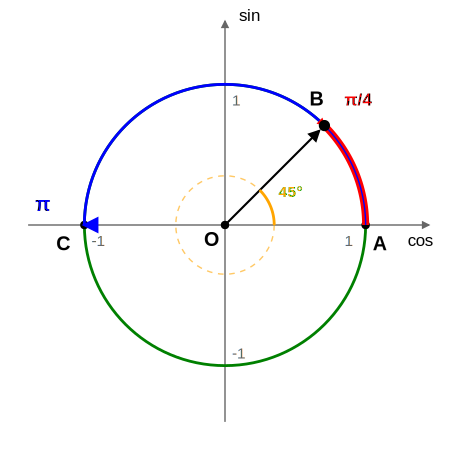

$l = 2\pi R \qquad S = \pi R^2$

**Радиус** (он же **радиан**) задает меру длины, т.е:
$l = 2\pi \; (\mathrm{rad})$
$S = \pi \; (\mathrm{rad}^2)$
Это значит что дуги окружности и длину всей окружности измеряем в радиусах.

Не радиус единичной длины, а окружность диктует меру длины и нормализует единицу измерения по осям.

Если мы находимся в точке $A$ и начинаем двигаться вдоль окружности до т.$B$ **какое расстояние** мы преодолеем?
А если из т.$A$ в т.$C$?

Т.е. $\pi$ - это **расстояние**, которое необходимо преодолеть, двигаясь вдоль окружности, от произвольной точки на окружности до диагонально противоположной, а ещё площадь круга, ограниченного окружностью, а **угол** - это длина дуги в радиусах

$\pi$ - иррационально

 

---

Несколько способов добраться до заданной точки на плоскости

**1.** Алгебраически: $\overrightarrow{OC'} = 2\cdot\overrightarrow{OB} + 2\cdot \overrightarrow{OA}$
**2.** Тригонометрически: $\overrightarrow{OC'} = r\cdot(\sin{φ}\cdot \overrightarrow{OB} + \cos{φ}\cdot\overrightarrow{OA})$, $r$ - во сколько раз нужно удлинить вектор $OC$ чтобы добраться до т.$C'$
**3.** Повернуть единичный вектор $\overrightarrow{OA}$ на угол $\varphi = \pi/4$ и домножить на $r$

**PS:** Можно заметить, что вектор $|\overrightarrow{OC}| = 1$ и работает теорема Пифагора $\cos^2{φ} + \sin^2{φ} = 1$

---

**Комплексная плоскость**

Пусть $\sqrt{-1} = i$, тогда $i^2=-1$.
Тогда например число $2+\sqrt{-121}$ можно представить так:
$2+\sqrt{-121} = 2 + 11\sqrt{-1} = 2 + 11i$

Помимо действительной оси $\mathbb{R}$ введем мнимую ось $\text{Im}$, на оси которой будут откладываться числа вида $a\cdot i = a\sqrt{-1}$ (например $i, -i, 2i, 11i, -2i, \frac{3}{4}i$ и т.д.), тогда точку $C'$, мы можем задать в виде $2+2i$

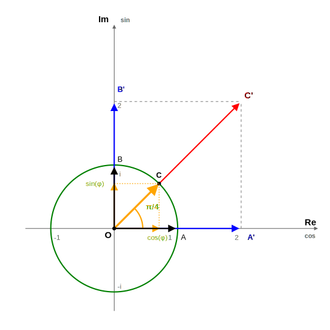

---

Почему мы выбрали мнимую ось $\text{Im}$ именно таким образом.
Потому что умножение вектора на $-1$ означает поворот на $\pi$ (или на $180^0$), но $i^2 = -1$, что тоже означает поворот на $\pi$, а это значит, что умножение $i$ должено быть поворотом на $\frac{\pi}{2}$

Вектор $\overrightarrow{OA}\cdot i = \overrightarrow{OB}$

И для произвольного вектора:
Вектор $\overrightarrow{OC}\cdot i = (\cos{φ} + i\cdot\sin{φ})\cdot i = i\cos{φ} + i^2\sin{φ} = -\sin{φ} + i\cos{φ}$
$\overrightarrow{OC}\cdot i = \cos{(φ+\frac{\pi}{2})} + i\cdot\sin{(φ+\frac{\pi}{2})}$

---

У комлексного числа есть три формы записи:
1. **Алгебраическая**:
$\overrightarrow{OC'} = 2\overrightarrow{OA} + 2\overrightarrow{OB} = 2\cdot \vec{1} + 2 \cdot \vec{i}$
$C'=2+2i$

2. **Тригонометрическая**:
$\overrightarrow{OC'} = r\cdot(\cos{φ}\cdot\overrightarrow{OA} + \sin{φ}\cdot \overrightarrow{OB}) = r\cdot(\cos{φ}\cdot\vec{1} + \sin{φ}\cdot\vec{i})$
$C' = r(\cos{φ} + i\cdot\sin{φ})$

3. **Экспоненциальная**:
$e^{iφ}=\cos{φ} + i\cdot\sin{φ}$ - формула Эйлера
$C' = r\cdot e^{iφ}$

---

**Смысл формулы Эйлера**

$$e^{iφ}=\cos{φ} + i\cdot\sin{φ}$$

$(e^{iφ})' = i\cdot e^{iφ}$
$(e^{iφ})'' = i^2\cdot e^{iφ} = -1\cdot e^{iφ}$
$(e^{iφ})''' = -i\cdot e^{iφ}$
$(e^{iφ})^{IV} = e^{iφ}$
Заметим, что $(\cos{φ})^{IV} = \cos{φ}; \quad (\sin{φ})^{IV} = \sin{φ}$

Возведение $e^{iφ}$ означает поворот единичного вектора $\vec{1}$ на угол $φ$

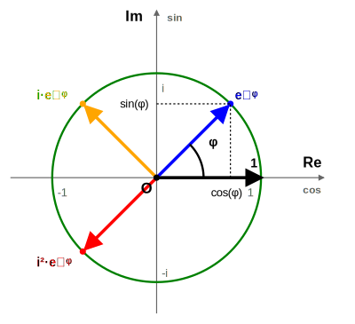
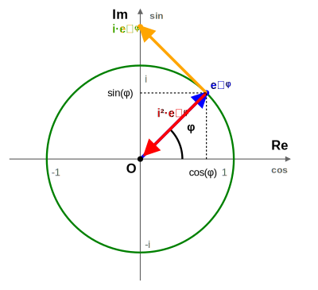

 

Если геометрически $e^{iφ}$ это поворот на угол $φ$, то в частности поворот вектора $\vec{1}$ на $\pi$ будет равен $-1$, т.е.
$$
\boxed{e^{i\cdot π} = -1}
$$

---

Комплексная плоскость - это не $x$, $y$ - оси, где $x$ - область определения, $y$ - область значений

В случае с функцией $e^{iφ}$, $φ$ - область определения, а комлексная плоскость - область значений.

  <figure style="width: 45%; margin: 0;">
    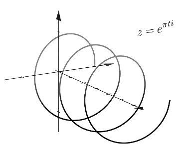
    <figcaption style="font-size: 0.8em;">3D визуализация функции <i>eⁱᵠ</i></figcaption>
  </figure>
  <figure style="width: 45%; margin: 0;">
    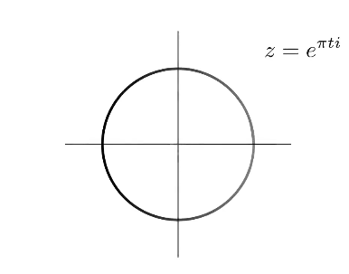
    <figcaption style="font-size: 0.8em;">Проекция функции <i>eⁱᵠ</i> на комплексную плоскость</figcaption>
  </figure>
  <figure style="width: 45%; margin: 0;">
    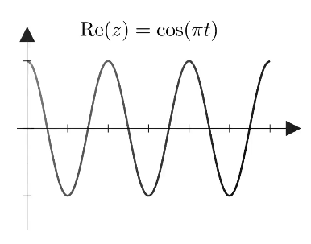
    <figcaption style="font-size: 0.8em;">Проекция функции <i>eⁱᵠ</i> на плоскость <b>φ Re</b></figcaption>
  </figure>
  <figure style="width: 45%; margin: 0;">
    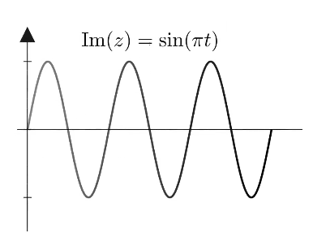
    <figcaption style="font-size: 0.8em;">Проекция функции <i>eⁱᵠ</i> на плоскость <b>φ Im</b></figcaption>
  </figure>

---

**Сложение комплексных чисел**

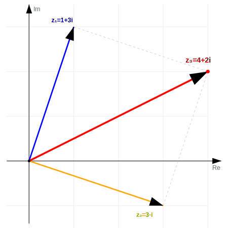

$z_1 = 1 + 3i,\; z_2 = 3 - i$
$z_3 = z_1 + z_2 = 1 + 3i + 3 - i$
$z_3 = 4 - 2i$

 

---

**Вычитание комплексных чисел**

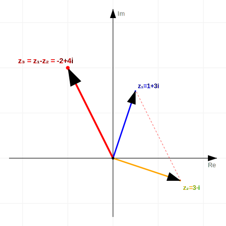

$z_1 = 1 + 3i,\; z_2 = 3 - i$
$z_3 = z_1 - z_2 = -2 + 4i$

 

---

**Умножение комплексных чисел**

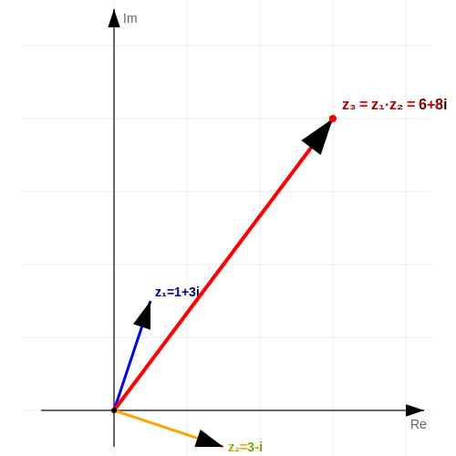

$z_1 = 1 + 3i,\; z_2 = 3 - i$
$z_3 = z_1 \cdot z_2 = (1 + 3i)(3 - i)$
$z_3 = 6 + 8i$

 

---

**Деление комплексных чисел**

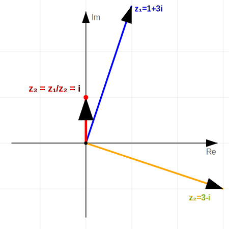

$$z_3 = \frac{1 + 3i}{3 - i} = \frac{(1 + 3i)(3 + i)}{(3 - i)(3 + i)} = $$
$$z_3 = \frac{3 + i + 9i + 3i^2}{9 + 1} = \frac{10i}{10} = i$$

 

---

**Корень из комплексного числа**:

Основная идея: у любого комплексного числа (кроме нуля) ровно $n$ корней $n$-й степени, и все они лежат на одной окружности.

Например из задачи Бомбелли:

$\sqrt[3]{2-11i}$

По формуле Муавра:
$$w_k = \sqrt[n]{r} \left( \cos \frac{\varphi + 2\pi k}{n} + i \sin \frac{\varphi + 2\pi k}{n} \right)$$
получим три корня:

$w_0 = 2 - i$
$w_1 \approx -0.13 + 2.23i$
$w_2 \approx -1.87 - 1.23i$

Один из которых $w_0$ был найден Бомбелли подбором.
Соответственно для $\sqrt[3]{2+11i}$ получим:

- $w_0 = 2 + i$
- $w_1 \approx -1.87 + 1.23i$
- $w_2 \approx -0.13 - 2.23i$

$w_0 = 2 + i$ тоже был найден Бомбелли подбором.

---

**Задача:**
Выразить $\cos^7{x}$ через первые степени косинусов кратных аргументов.
*(см. Андронов И.К, Окунев А.К. Курс тригонометрии, 1967г, стр. 622-623)*

$\square$

Воспользуемся фактом, что:
$$
\left\{
\begin{matrix}
\cos{φ} = \frac{e^{iφ} + e^{-iφ}}{2} \\
\sin{φ} = \frac{e^{iφ} - e^{-iφ}}{2i}
\end{matrix}
\right .
$$

Это следует из формулы Эйлера $e^{iφ} = \cos{φ} + i\cdot\sin{φ}$:

$$
\left \{
\begin{matrix}
e^{iφ} = \cos{φ} + i\cdot\sin{φ} \\
e^{-iφ} = \cos{φ} - i\cdot\sin{φ}
\end{matrix}
\right .
$$

А теперь применим формулу косинуса, выраженную через экспоненту и формулу бинома Ньютона:

$$
\cos^{7}x = \left( \frac{e^{ix} + e^{-ix}}{2} \right)^{7} = \frac{1}{2^{7}} (e^{ix} + e^{-ix})^{7} = \\
= \frac{1}{2^{7}} (e^{7xi} + 7e^{5xi} + 21e^{3xi} + 35e^{xi} + 35e^{-xi} + 21e^{-3xi} + 7e^{-5xi} + e^{-7xi}) = \\
= \frac{1}{2^{6}} \left( \frac{e^{7xi} + e^{-7xi}}{2} + 7 \frac{e^{5xi} + e^{-5xi}}{2} + 21 \frac{e^{3xi} + e^{-3xi}}{2} +  35 \frac{e^{xi} + e^{-xi}}{2} \right) = \\
= \frac{1}{2^{6}} (\cos 7x + 7 \cos 5x + 21 \cos 3x + 35 \cos x).
$$

$\blacksquare$

То же самое можно проделать для любых степеней $\sin^n{φ}$ или $\cos^n{φ}$
**Применение:** если забыл на экзамене, как понижать степень у косинуса и синуса, то можно применить подобный подход

---

