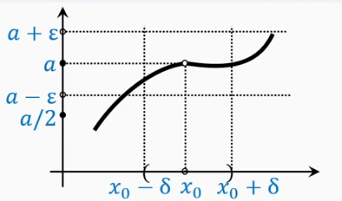

$$
\newcommand{\Def}{{\color{green}\boxed{\mathbf{Def:}}}}
\newcommand{\Th}[1]{{\color{green}\boxed{\mathbf{Th~#1:}}}}
\newcommand{\St}[1]{{\color{green}\boxed{\mathbf{Statement~#1:}}}}
\newcommand{\Cons}{{\color{green}\boxed{\mathbf{Cons:}}}}
\newcommand{\Ex}[1]{{\color{green}\boxed{\mathbf{Example~#1:}}}}
\newcommand{\Prob}[1]{{\color{green}\boxed{\mathbf{Problem~#1:}}}}
\newcommand{\Disc}{{\color{blue}\boxed{\mathbf{Discussion:}}}}
\newcommand{\NB}{{\color{orange}\boxed{\mathbf{NB!:}}}}
\newcommand{\ra}{\rightarrow}
\newcommand{\Ra}{\Rightarrow}
\newcommand{\hra}{\hookrightarrow}

\newcommand{\bRa}{{\Large\color{green}\boxed{\Rightarrow}}}
$$

## Предел функции в точке. Критерий Коши. Определение сходимости по Гейне и эквивалентность определений.

**Запись окрестностей:**
$U_{\delta}(+\infin) = \{x: x > \delta\}$
$U_{\delta}(-\infin) = \{x: x < -\delta\}$
$U_{\delta}(\infin) = \{x: |x| > \delta\} = U_{\delta}(-\infin) \cup U_{\delta}(+\infin)$
$U_{\delta}(x_0) = \{x: |x - x_0| < \delta \}$
$\mathring{U}_{\delta}(x_0) = \{x: 0 < |x - x_0| < \delta \}$

$U^{-}_{\delta}(x_0) = \{x: x \in (x_0 - \delta, x_0] \}$
$U^{+}_{\delta}(x_0) = \{x: x \in [x_0, x_0 + \delta) \}$
$\mathring{U}^{-}_{\delta}(x_0) = \{x: x \in (x_0 - \delta, x_0) \}$
$\mathring{U}^{+}_{\delta}(x_0) = \{x: x \in (x_0, x_0 + \delta) \}$

$\Def$ **по Коши:**

Пусть $\mathring{U}_{\delta_0}(x_0) \subset D(f)$:
$$
\mathring{U_{\delta}}(x_0) = \{x: 0 < |x - x_0| < \delta\} \\
U_{\varepsilon}(y_0) = \{y: 0 \le |y - y_0| < \varepsilon\}
$$
$$
\lim_{x\ra x_0}f(x) = y_0 \iff \forall{\varepsilon > 0}\; \exists\delta(\varepsilon) \in (0, \delta_0): \; \forall{x} \in \mathring{U_{\delta}}(x_0) \hra f(x) \in U_{\varepsilon}(y_0)
$$
Противоположное ему утверждение:
$$
\lim_{x\ra x_0}f(x) \ne y_0 \iff \exists{\varepsilon > 0}\; \forall\delta(\varepsilon) \in (0, \delta_0) \hra \; \exists{x} \in \mathring{U_{\delta}}(x_0) : f(x) \notin U_{\varepsilon}(y_0)
$$

$\bRa$ Из определения следует, что функция не может иметь двух разных пределов в одной точке.
$\bRa$ Из определения также следует, что значения функции $f(x)$ в точках $x \in \mathring{U_{\delta}}(x_0)$ и $f(x_0)$ не влияют на существование и на величину предела функции $f(x)$ в точке $x_0$

$\Def$ **Последовательностью Гейне** точки $x_0 \in \overline{R}$ называется последовательность:
$$
\{x_n\} \subset \mathring{U}_{\delta_0}(x_0) \subset D(f)
$$
которая сходится к точке $x_0: x_n \ra x_0$
$\NB$ элементы последовательности необязательно все должны принадлежать окрестности точки $x_0$, но они обязательно должны принадлежать области определения функции

$\Def$ **Определение предела функции по Гейне:**
$$
\lim_{x\ra x_0}f(x) = a \iff \forall\{x_n\}: (x_n \in \mathring{U_{\delta}}(x_0) \land \lim_{n\ra \infin}{x_n} = x_0) \hra \lim_{n\ra \infin}{f(x_n)} = a
$$

$\NB$ Для того чтобы доказать, что функция $f(x)$ не имеет предела в точке $x_0$, достаточно указать какую-нибудь последовательность $\{f(x_n)\}$, не имеющую предела, или указать две последовательности $\{f(x_n)\}$ и $\{f(x'_n)\}$, имеющие разные пределы.

$\St{}$ Определения предела функции по Коши и по Гейне эквивалентны

$\Def$ Если функция $f(x)$ определена в точке $x_0$, существует $\lim_{x\ra x_0}{f(x)} = a = f(x_0)$, то функцию $f(x)$ называют **непрерывной в точке** $x_0$

### Эквивалентность двух определений:

$\Th{2.1}$
> Определения предела по Коши и Гейне эквивалентны.

$\square$
Пусть выполнено определение по Коши и пусть $\{x_n\}$ - произвольная последовательность Гейне.

Тогда $\forall{\varepsilon > 0} \; \exists{\delta} = \delta(\varepsilon)$, для которого выполняется определение по Коши.

Но по $\delta$, в силу определения последовательности Гейне, найдется такой номер $N$, что для всех больших номеров $n > N$ справедливо: $x_n \in \mathring{U}_{\delta}(x_0)$

Но тогда верно: $f(x_n) \in U_{\varepsilon}(y_0)$ (по определению Коши)

**Обратно:**
Пусть имеет место определение Гейне.

Допустим, от противного, что определение по Коши не выполнено. Покажем, что в этом случае найдется последовательность Гейне, для которой определение Гейне не выполняется.

$$
\exists{\varepsilon_0 > 0}\; \forall\delta \in (0, \delta_0) \hra  \; \exists{x} \in \mathring{U_{\delta}}(x_0) :f(x) \notin U_{\varepsilon_0}(y_0) \qquad (1)
$$

Пусть $x_1$ - произвольная точка, удовлетворяющая $(1)$ при произвольном выбранном $\delta = \delta_1$

Возьмем $\delta_2 = |x_1 - x_0|/2$

В проколотой $\delta_2$ - окрестности точки $x_0$ найдется точка $x_2$, удовлетворяющая $(1)$

Затем возьмем $\delta_3 = |x_2 - x_0|/2$ и выберем точку $x_3$, удовлетворяющую $(1)$

И т.д.

Мы получили последовательность Гейне $\{x_n\}$ точки $x_0$, для которой $f(x_n) \nrightarrow y_0$

противоречие

$\blacksquare$

## 4.4. Свойства предела функции

$\Th{}$ Если предел существует, то он единственный

$\Th{}$ **Теорема о неравенствах**
Пусть:
$(1)$ Функции $f$ и $g$ определены в некоторой проколотой окрестности точки $x_0 \in \overline{\mathbb{R}}$
$(2)$ $\exists \lim_{x \ra x_0}f(x) = a \in \mathbb{R}$, $\exists \lim_{x \ra x_0}g(x) = b \in \mathbb{R}$

**1.** Перенос неравенства с пределов на значения функций:
Пусть $a < b$, тогда существует такая проколатая $\delta$ - окрестность точки $x_0$, что для всех $x \in \mathring{U}_{\delta}(x_0)$ верно $f(x) < g(x)$

**2.** Перенос неравенства со значений функции на их пределы:
если для всех $x \in \mathring{U}_{\delta}(x_0)$ верно $f(x) \le g(x) (<)$, то $a \le b$

**3.** О трех функциях:
Пусть:
$(1)$ функция $h$ определена в той же проколотой окрестности, что и функции $f$ и $g$,
$(2)$ в ней выполняется **двусторонняя** оценка
$$
f(x) \le h(x) \le g(x)\; (<)
$$
$(3)$ указанные пределы совпадают, т.е. $a = b$

Тогда $\exists \lim_{x\ra x_0} h(x) = a$

**Следствие (об отделении от нуля)**
Если $\lim_{x\ra x_0}f(x) = a > 0$,
то существует такая проколотая $\delta$ окрестность точки $x_0$, что для всех $x$ из нее $f(x) > a/2$

$\Th{}$ **(об арифметических операциях)**

Пусть:
$(1)$ $f$ и $g$ определены в некоторой проколотой окрестности точки $x_0 \in \overline{\mathbb{R}}$,

$(2)$ $\exists \lim_{x \to x_0} f(x) = a \in \mathbb{R}$, $\exists \lim_{x \to x_0} g(x) = b \in \mathbb{R}$.

Тогда:

1. $\lim_{x \to x_0} |f(x)| = |a|$.
2. $\lim_{x \to x_0} (f(x) \pm g(x)) = a \pm b$.
3. $\lim_{x \to x_0} (f(x) \cdot g(x)) = a \cdot b$.
4. Если предел $b \neq 0$, то $\lim_{x \to x_0} \left(\frac{f(x)}{g(x)}\right) = \frac{a}{b}$.

**Доказательство:**
Все утверждения доказываются единообразно с помощью определения предела по Гейне и ссылкой на аналогичное утверждение о пределах последовательностей.

## 4.7 Критерий Коши

$\NB$ **Критерий** - то, что требует доказательства в обе стороны

$\Th{4.7}$ **Критерий Коши**
Пусть функция $f$ определена в $\mathring{U}_{\delta_0}(x_0)$, где $x_0 \in \mathbb{R}$.

Функция $f$ имеет **конечный** предел в точке $x_0$ только тогда, когда выполнено **условие Коши**:

$$\forall \varepsilon > 0 \ \exists \delta \in (0, \delta_0) : \forall x', x'' \in \mathring{U}_{\delta}(x_0) \hra |f(x') - f(x'')| < \varepsilon$$

$\square$
Необходимость вытекает из определения предела по Коши и неравенства треугольника.

Пусть: $\lim_{x\ra x_0}f(x) = a \in \mathbb{R}$
тогда:
$$
\forall{\varepsilon >0 } \exists{\delta} \in (0, \delta_0): \forall{x', x''} \in \mathring{U}_{\delta}(x_0) \hra \\
|f(x') - a| < \frac{\varepsilon}{2} \land |f(x'') - a| < \frac{\varepsilon}{2} \Ra
$$
$$
\forall{\varepsilon >0 } \exists{\delta} \in (0, \delta_0): \forall{x', x''} \in \mathring{U}_{\delta}(x_0) \hra \\
|f(x') - f(x'')| \le |f(x') - a| + |f(x'') - a| < \frac{\varepsilon}{2} + \frac{\varepsilon}{2} = \varepsilon
$$

**Достаточность**
Пусть выполнено условие Коши

Покажем что в этом случае функция имеет предел по Гейне

Пусть $\{x_n\}$ — произвольная последовательность Гейне точки $x_0$.

Она порождает последовательность значений $\{f(x_n)\}$.

Возьмём произвольное $\varepsilon > 0$.

По нему найдём $\delta = \delta(\varepsilon)$ из условия Коши.

Поскольку $x_n \to x_0$, то, начиная с какого-то номера $N = N(\delta)$, значения всех элементов последовательности $\{x_n\}$ окажутся в $\overset{\circ}{U}_{\delta}(x_0)$.

Тогда из условия Коши следует, что:

$$|f(x_n) - f(x_m)| < \varepsilon$$

для любых $n, m > N$.

Последовательность $\{f(x_n)\}$ фундаментальна.

Из критерия Коши для последовательностей следует, что существует число $a$, к которому сходится последовательность $\{f(x_n)\}$.

Если мы возьмём любую другую последовательность Гейне $\{x_n'\}$, то опять получим предел $f(x_n') \rightarrow a'$.

На самом деле $a' = a$.

Возьмём чередование элементов двух последовательностей:

$x_1'' := x_1$,
$x_2'' := x_1'$,
$x_3'' := x_2$,
$x_4'' := x_2'$,  …

Это тоже последовательность Гейне, и для неё последовательность значений сходится:

$f(x_n'') \rightarrow a'' \in \mathbb{R}$.

Значит, пределы равны: $a = a' = a''$.

**Вывод:** для произвольной последовательности Гейне, т.е.:
$\forall\{x_n\}: (\lim_{n\ra \infin}{x_n} \ra x_0 \land x_n \ne x_0 \land x_n \in D(f)) \hra$

$$\lim_{n \to \infty} f(x_n) = a \iff \lim_{x \to x_0} f(x) = a; \; a \in \mathbb{R}$$

$\blacksquare$

## Список литературы
**1.** Кудрявцев Л.Д., Кутасов А.Д., Чехлов В.И., Шабунин М.И.
**Сборник задач по математическому анализу**. Том 1. Предел. Непрерывность. Дифференцируемость: Учеб. пособие/ Под ред. Л.Д. Кудрявцева. — 2-е изд., перераб. — М.: ФИЗМАТЛИТ, 2003. — 496 с. — ISBN 5-9221-0306-7.
