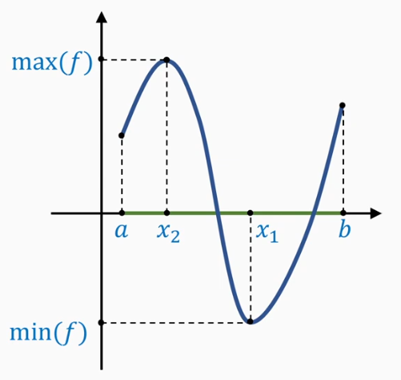
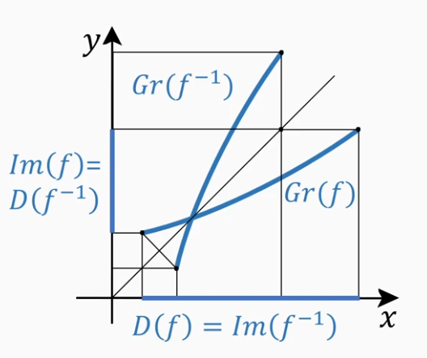

$$
\newcommand{\Def}{{\color{green}\boxed{\mathbf{Def:}}}}
\newcommand{\Th}[1]{{\color{green}\boxed{\mathbf{Th~#1:}}}}
\newcommand{\Lm}[1]{{\color{green}\boxed{\mathbf{Lemma~#1:}}}}
\newcommand{\St}[1]{{\color{green}\boxed{\mathbf{Statement~#1:}}}}
\newcommand{\Cons}{{\color{green}\boxed{\mathbf{Cons:}}}}
\newcommand{\Ex}[1]{{\color{green}\boxed{\mathbf{Example~#1:}}}}
\newcommand{\Prob}[1]{{\color{green}\boxed{\mathbf{Problem~#1:}}}}
\newcommand{\Disc}{{\color{blue}\boxed{\mathbf{Discussion:}}}}
\newcommand{\NB}{{\color{orange}\boxed{\mathbf{NB!:}}}}
\newcommand{\ra}{\rightarrow}
\newcommand{\Ra}{\Rightarrow}
\newcommand{\hra}{\hookrightarrow}

\newcommand{\bRa}{{\Large\color{green}\boxed{\Rightarrow}}}
$$

## Непрерывность функции в точке. Непрерывность функции на множестве. Равномерная непрерывность. Свойства функций, непрерывных в точке. Разрывы первого и второго рода.

### **5.1** Непрерывность функции в точке и на отрезке

$\Def$ Функция $f(x): U_{\varepsilon}(x_0) \in D(f); x_0 \in \mathbb{R}$ называется **непрерывной** в точке $x_0$, если $\lim_{x\ra x_0}f(x) = f(x_0) \in \mathbb{R}$

### **5.2** Свойства функции, непрерывных в точке

$\Th{5.2.1}$ **о непрерывности арифметических операций**

Пусть функции $f$ и $g$ непрерывны в точке $x_0$.
Тогда функции:
$f(x) \pm g(x)$
$f(x)\cdot g(x)$
$f(x)/g(x), g(x_0) \ne 0$, непрерывны в точке $x_0$

$\square$
Доказательство следует из теоремы о связи между пределом функции и арифметическими операциями
$\blacksquare$

$\Th{5.2.2}$ **о непрерывности сложной функции**
Пусть функция $f$ непрерывна в точке $x_0$, а функция $g$ в точке $y_0 = f(x_0)$, то тогда $u = g(f(x))$ непрерывна в точке $x_0$

$\square$
Из определения непрерывности получаем:
$$
\lim_{x\ra x_0}{g(f(x))} = g(\lim_{x \ra x_0}{f(x)}) = g(f(x_0)) = g(y_0)
$$
$\blacksquare$

### **5.3** Свойства функций непрерывных на отрезке

$\Def$ Функция называется **непрерывной на отрезке**, если она непрерывна во всех внутренних точках, а на концах имеет место односторонняя непрерывность

$\Th{5.3.1}$ **Первая теорема Вейерштрасса об ограниченности**
Если функция $f$ **непрерывна** на отрезке $[a, b]$, то она **ограничена** на нем.

$\square$
В противном случае существует последовательность значений функции $\{y_n\} \subset f([a, b])$, для которой $|y_n| \ge n$

Для каждого значения функции выберем его произвольный прообраз $x_n$, то есть $f(x_n) = y_n$, где $\{x_n\} \subset [a, b]$

Из теоремы **Больцано-Вейерштрасса** следует, что существует подпоследовательность $x_{n_k} \ra x_0$ при $k \ra \infin$

В силу двухсторонней оценки $a \le x_n \le b$, справедливо: $\lim_{k \ra \infin}{x_{n_k}} = x_0 \in [a, b]$

Поскольку функция $f(x)$ непрерывна в точке $x_0$, то $\lim_{k \ra \infin}{x_{n_k}} = f(x_0) \in \mathbb{R}$

С другой стороны:

$|f(x_{n_k})| = |y_{n_k}| \ge n_k \ge k$ при $k \ra \infin$

Т.е. $\lim_{k \ra \infin}{x_{n_k}} = \infin$

противоречие

$\blacksquare$

$\Th{5.3.2}$ Вторая теорема Вейерштрасса **о достижении точных граней**

Если функция $f$ непрерывна на отрезке $[a, b]$, то существуют точки $x_1, x_2 \in [a, b]$, в которых:
$$
f(x_1) = \inf_{[a, b]}{f(x)} = \min_{[a, b]}{f(x)}
$$
$$
f(x_2) = \sup_{[a, b]}{f(x)} = \max_{[a, b]}{f(x)}
$$
Т.е. непрерывная функция на отрезке **достигает** свои точные нижнюю и верхнюю грани.

$\square$

Согласно первой теореме Вейерштрасса точная верхняя грань образа $f([a, b])$, конечна:

$$
\exists{M} = \sup_{[a, b]}f(x) \in \mathbb{R}
$$

Из определения супремума следует, что:
$$
\forall{n \in \mathbb{N}}\; \exists{y_n} \in f([a, b]): M - \frac{1}{n} < y_n \le M
$$

Т.к. $y_n \in f([a, b])$, то $\exists\{x_n\} \subset [a, b]: f(x_n) = y_n$

$\exists{x_{n_k}} \ra x_0 \in [a, b]$ при $k \ra \infin$

Поэтому

$M - \frac{1}{n_k} < f(x_{n_k}) \le M, \; x_{n_k} \ra x_0 \in [a, b]$ при $k \ra \infin$

Переходя в двусторонней оценке к пределу, в силу непрерывности функции в точке $x_0$, получаем $f(x_0) = M$

$\blacksquare$

### **5.3** Теорема Больцано-Коши

$\Th{5.3.1}$ Больцано-Коши **о нуле знакопеременной функции**

Если функция $f(x)$ непрерывна на отрезке $[a, b]$ и принимает в его концах значения разных знаков, то $\exists{c} \in (a, b): f(c) = 0$

$\square$ методом половинного деления
$\blacksquare$

$\Th{5.3.2}$ **о промежуточных значениях**
Если функция $f(x)$ непрерывна на отрезке $[a, b]$, то для любого промежуточного значения $y_0$, заключенного между $f(a)$ и $f(b)$, существует число $c \in [a, b]$, для которого $f(c) = y_0$

$\square$
следует применить теорему Больцано-Коши к функции $g(x) = f(x) - y_0$
$\blacksquare$

$\Th{5.3.3}$ **о непрерывном образе отрезка**
Если функция $f(x)$ непрерывна на отрезке $[a, b]$, то ее образом является отрезок $[m, M]$, где $m = \inf_{[a, b]}f(x)$, $M = \sup_{[a, b]}f(x)$

$\square$
доказательство следует из второй теоремы Вейерштрасса и теоремы о промежуточных значениях
$\blacksquare$

### **5.5** Задача. Непрерывность функции

$f(x)$ - непрерывна в точке $x_0 \iff$

**1.** $\lim_{x \ra x_0}f(x) = f(x_0)$

**2.** $\forall{\varepsilon > 0} \; \exists{\delta > 0}: \forall{x} \in U_{\delta}(x_0) \hra f(x_0) \in U_{\varepsilon}(x_0)$

**3.** $\forall{\{x_n\}}: \lim_{n \ra \infin}{x_n} = x_0 \hra \lim_{n \ra \infin}f(x_n) = f(x_0)$

Доказать
$$
f(x) = \text{sign}(x) =
\left\{
    \begin{matrix}
        1, x > 0 \\
        0, x = 0 \\
        -1, x < 0
    \end{matrix}
\right .
$$
не непрерывна в точке $x_0 = 0$

### **6.1** Обратная функция

Способы задания функций:
1. Обратная функция
2. Неявно
3. Параметрически

$\Def$ Пусть функция $f$ - биекция между $D(f)$ и $Im(f)$, тогда обратное соответствие между $Im(f)$ и $D(f)$ называется **обратной функцией**, которую обозначают $f^{-1}$

**Свойства обратной функции:**
**1.** $D(f^{-1}) = Im(f)$, $Im(f^{-1}) = D(f)$
**2.** $(f^{-1})^{-1} = f$
**3.** $\forall{x} \in D(f) \hra f^{-1}(f(x)) \equiv x$
$\forall{y} \in D(f^{-1}) \hra f(f^{-1}(y)) \equiv y$

$Gr(f)$ является не только графиком функции $f$, но и графиком обратной функции, если в качестве аргумента брать числа $y$

Но поскольку традиционно ось $x$ горизонтальна, а $y$ - вертикальна, то чтобы получить график обратной функции $Gr(f^{-1})$ нужно оси поменять местами.

$\Th{6.1}$ **об обратной функции на отрезке**
Пусть функция $f$ строго возрастает (убывает) на отрезке $[a, b]$ и непрерывна на нем. Тогда существует обратная функция, определенная на отрезке $[f(a), f(b)]$ ($[f(b), f(a)]$), строго возрастающая (убывающая) и непрерывная на нем.

$\square$
Строго возрастающая функция является биекцией.

В силу непрерывности, образом функции является отрезок $[m, M]$, где
$$
m = \inf{f(x)}, \;M = \sup{f(x)}, \; x \in [a, b]
$$

В силу строгого возрастания $m = f(a),\;M = f(b)$

Итак, $f$ - строго возрастающая биекция между $[a, b]$ и $[m, M]$

Обратная биекция $f^{-1}$ также строго возрастает

Докажем непрерывность обратной функции.

В противном случае существует $y_0 \in [m, M]$ - точка разрыва для $f^{-1}$

Значит, в $y_0$ выполняется хотя бы одно из двух условий:
- левый предел строго меньше значения функции
- правый предел строго больше значения функции

Пусть левый предел строго меньше значения функции:

$$
\lim_{y\ra y_0 - 0}{f^{-1}(y)} := f^{-1}(y_0 - 0) < f^{-1}(y_0)
$$

Значит, невырожденный интервал:
$$
(f^{-1}(y_0 - 0), f^{-1}(y_0)) \subset (a, b)
$$
**НЕ** принадлежит образу
$$
Im(f^{-1}) = D(f)
$$
противоречие

$\blacksquare$

### **6.2** Равномерная непрерывность

$\Def$ Функция **непрерывна** на множестве $X$ если:

$\forall{x} \in X \land \forall{\varepsilon > 0} \; \exists{\delta} = \delta(x, \varepsilon): \forall{x'} \in X \land \rho(x, x') < \delta \hra |f(x) - f(x')| < \varepsilon$

$\Def$ Функция $f$ называется **равномерно непрерывной** на подмножестве $X \subset \mathbb{R}$, если
$$
\forall{\varepsilon > 0} \; \exists{\delta} = \delta(x, \varepsilon) > 0: \forall{x, x' \in X} \land \rho(x, x') < \delta \hra |f(x) - f(x')| < \varepsilon
$$

$\Lm{}$ **о свойствах равномерной непрерывности**
Если функция $f$ равномерно непрерывна на некотором множестве $X$, то:
- она равномерно непрерывна на любом его подмножестве $\tilde{X} \subset X$
- из равномерной непрерывности функции на $X$ следует ее непрерывность на $X$

$\Th{6.2.1}$ **об арифметический операциях равномерно непрерывных функций**

Пусть функции $f$ и $g$ равномерно непрерывны на множестве $X$. Тогда:
**1.** их линейная комбинация $\alpha f + \beta g$ также равномерно непрерывна на $X$

**2.** если дополнительно функции ограничены на $X$, то их произведение $f \cdot g$ также равномерно непрерывно на $X$

$\Def$ Подмножество $X \subset \mathbb{R}$ называется **компактным**, если из любой последовательности $\{x_n\} \subset X$ можно выделить подпоследовательность, сходящуюся в $X$:
$$
\exists{x_{n_k}} \ra x_0 \in X, k \ra \infin
$$

$\Ex{}$
- отрезок - компактное подмножество
- полуинтервал - не компактен

$\Th{6.2.2}$ **теорема Кантора**
Если функция $f$ непрерывна на компактном подмножестве, то она **равномерно непрерывна** на нем.

$\square$ **от противного**

Допустим что функция $f$ не является равномерно непрерывной, т.е.:
$$
\exists{\varepsilon_0 > 0}: \forall{\delta} > 0 \hra \exists{x, x'} \in X: \rho(x, x') < \delta \hra |f(x) - f(x')| \ge \varepsilon_0
$$

Возьмем последовательность чисел
$\delta_k = \frac{1}{k}, k \in \mathbb{N}$

Возникают две последовательности точек $x_k, x'_k \in X$ таких что $\rho(x_k, x'_k) < \frac{1}{k}$, но $|f(x_k) - f(x'_k)| \ge \varepsilon_0$

В силу компактности $X$, из $\{x_k\}$ выбираем сходящуюся подпоследовательность:
$x_{k_m} \ra x_0 \in X$ при $m \ra \infin$

$\rho(x_{k_m}, x'_{k_m}) < \frac{1}{k_m}$, поэтому $x'_{k_m} \ra x_0 \in X$ при $m \ra \infin$

В силу непрерывности функции в точке $x_0$, получаем
$$
\lim_{m \ra \infin}{f(x_{k_m})} = \lim_{m \ra \infin}{f(x'_{k_m})} = f(x_0)
$$

что **противоречит** допущению

$\blacksquare$